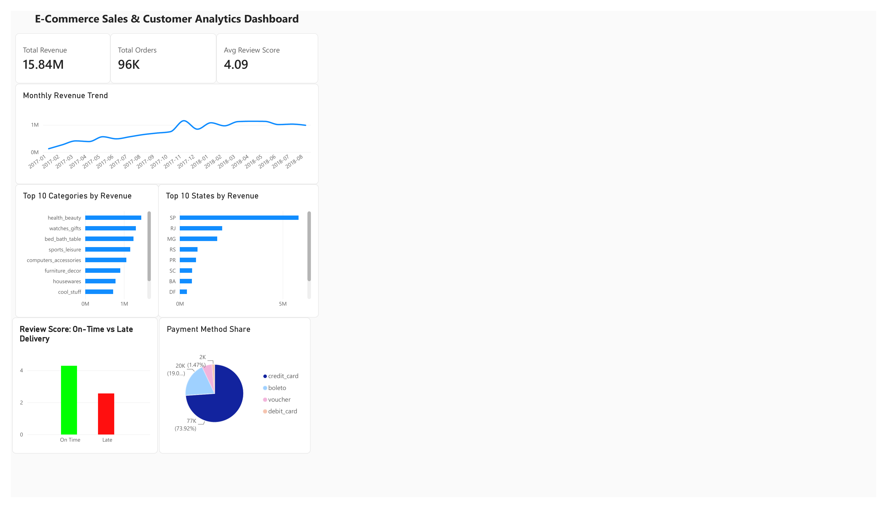

# E-Commerce Sales and Customer Analytics Dashboard

**Tools:** MySQL, Python (Pandas, Matplotlib), Power BI, Excel

End-to-end e-commerce analytics project using MySQL, Python, and Power BI to analyze sales, delivery performance, and customer reviews.

*Completed end-to-end analytics project: data cleaning, SQL analysis, Python EDA, and an interactive Power BI dashboard. See `docs/` for the full project brief and daily log.*

## Dashboard

[Download the full-resolution PDF](dashboard/exports/ecommerce_dashboard.pdf)

Built in Power BI, connected live to the MySQL database. Shows monthly revenue trends,
top categories and states by revenue, delivery performance vs customer satisfaction,
and payment method distribution.

**Key insights:**
- Late deliveries average 2.57 stars vs 4.29 for on-time — the strongest driver of poor reviews
- Only 3% of customers are repeat buyers
- Credit card is the dominant payment method (73.9%)
- São Paulo (SP) leads all states by revenue, more than double the next state

## Key Insights & Recommendations

1. **Delivery speed is the biggest driver of customer satisfaction.**
   Late deliveries average 2.57 stars vs 4.29 for on-time orders — a 1.7-point gap.
   *Recommendation: prioritize logistics improvements and realistic delivery estimates over other satisfaction levers.*

2. **Customer retention is very low.**
   Only 3% of customers are repeat buyers.
   *Recommendation: introduce a loyalty program or post-purchase engagement (email offers, discounts on next order) to improve retention.*

3. **Revenue is heavily concentrated in São Paulo.**
   SP generates more than double the revenue of the next-highest state (RJ).
   *Recommendation: investigate whether this reflects population/economic size alone, or whether other states are underserved and represent growth opportunity.*

4. **Credit card dominates payments (73.9%).**
   Boleto (bank slip) is a distant second at 19%.
   *Recommendation: ensure checkout and installment options remain optimized for credit card users, since it's the primary conversion path.*

5. **A small number of sellers combine high volume with low satisfaction.**
   At least one high-revenue seller has an average review score below 3.5.
   *Recommendation: flag sellers with high volume but low scores for a quality review, since they pose reputational risk at scale.*

   ## How to Run This Project
1. Download the dataset from Kaggle: [Brazilian E-Commerce Public Dataset by Olist](https://www.kaggle.com/datasets/olistbr/brazilian-ecommerce)
2. Create the MySQL database and tables: run `sql/01_create_tables.sql`
3. Load the data: `pip install pandas sqlalchemy pymysql` then `python scripts/load_data.py`
4. Run the SQL analysis: `sql/02_load_validation.sql`, `sql/03_data_quality_checks.sql`, `sql/04_business_analysis.sql`
5. Open `notebooks/eda.ipynb` for the Python EDA and charts
6. Open `dashboard/exports/ecommerce_dashboard.pbix` in Power BI Desktop for the interactive dashboard